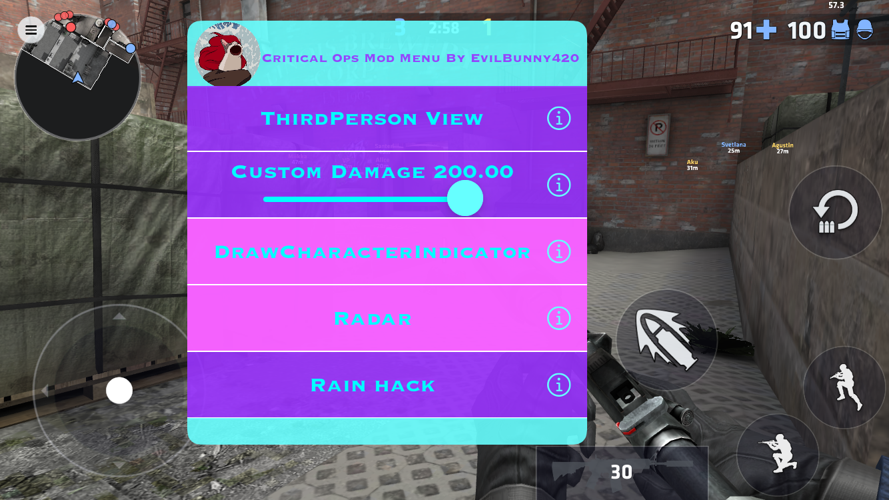

# Critical-Ops-1.39.4-IOS-Mod-Menu-Source

**FEATURES:**\
-ThirdPerson View\
-Custom Damage (1-200)\
-DrawCharacterIndicator\
-Radar\
-Rain Hack\
-Crosshair Always Visible\
-No Flash/Smoke\
-Shoot Through Walls\
-No Sniper Blur\
-Tutorial Bypass\
-Walk Through Walls\
-Crouch Shoot\
-No Aimpunch\
-Custom Height (1-10)\
-No Spread\
-No Dryfire\
-Increased JumpForce\
-Custom Speed (1-50)\
-Custom Camera Height (-10 - 25)\
-Custom FOV (25 - 155)\
-Infinite Ammo\
-Instant Reload\
-No Recoil\
-Melee Range 100m\
-Burst\
-Custom Firerate (100 - 1500)

## Credits:
<li><a href="https://github.com/joeyjurjens">joeyjurjens </a>
<ul dir="auto">
<li>For <a href="https://github.com/joeyjurjens/iOS-Mod-Menu-Template-for-Theos">Mod Menu Template</a></li>
</li>
  </ul>

